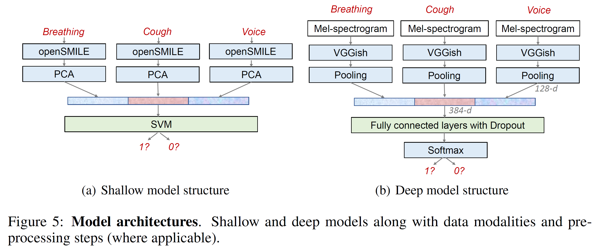
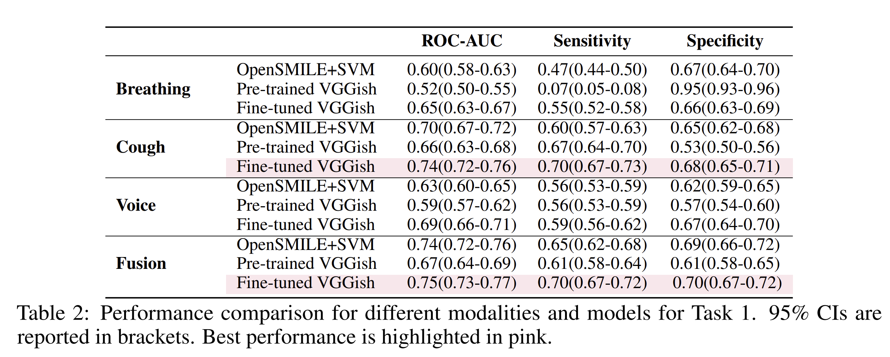
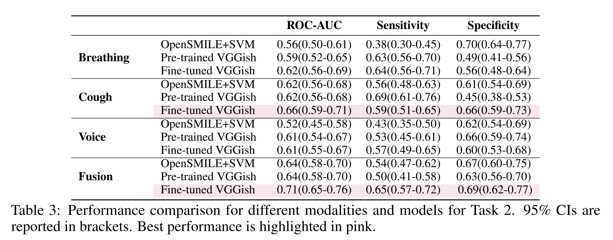

# COVID-19 Sounds Dataset Supplementary Material


This repository contains the supplementary material accompanying the paper named:
*COVID-19 Sounds: A Large-Scale Audio Dataset for Digital Respiratory Screening*.

## Introduction

Through crowdsourcing and the help of thousands of volunteers we started the COVID-19 Sounds project. The aim of
this research is to collect data to inform the diagnosis of COVID-19 by developing machine learning algorithms,
based primarily on sounds of their voice, their breathing and coughing. For more information you can check out
the project website [here][1]. If you wish to contact the team, you can do so at: covid-19-sounds@cl.cam.ac.uk

## Dataset

Naturally, data of such origin are sensitive in nature. Thus, to gain access to the full dataset, a Data
Transfer Agreement (DTA) needs to be signed. However, in order to enable reproducibility easier we make available two
small subsets used for the main tasks in the paper and are available in addition to the full dataset. Moreover, we
provide the metadata and overall statistics of the dataset in [this][2] notebook. The input files for this notebook
include raw location information and therefore cannot be shared for privacy reasons. Further, a notebook with more
granular information regarding the samples of each platform is provided [here][3].

## Code

Our models are implemented in Python 3 (tested using `3.6` and `3.7`) using Tensorflow `1.15`.
Please note that due to the requirement of Tensorflow `1.15` versions of python above `3.7` are **not** supported.
Before you start, please ensure that you have requested and downloaded the task files as they are not included when
cloning the repository. After receiving the files and in order to reproduce the results, you need to create an
appropriate virtual environment and activate it. You can create such an environment, as is shown below:

```bash
# create a virtual environment for this project (assuming you are in covid19-sounds-neurips)
python3 -m venv ./venv
# now activate it
source ./venv/bin/activate
# and finally, install the dependencies
pip install -r ./requirements.txt
```

As described in the paper, two tasks are contained. We will now describe how to reproduce each of the tasks using
the data provided.

## Benchmarks

For both tasks, we implemented three baselines, namely:

- OpenSMILE+SVM,
- pre-trained VGGish, and a
- fine-tuned VGGish.

Transfer learning is applied to our tasks through a pre-trained CNN model named [VGGish][5].
To help the reader to better understand the architectures used, we provide a simple illustration of the models
used below:



On the left of the figure we present the OpenSMILE+SVM while on the right we show the VGGish based model. We note that
the fine-tuned VGGish is the same architecture but with we fix the parameters of VGGish and jointly fine-tune its
backbone while also update the fully connected layers.

### Task 1: Respiratory symptom prediction

This task aims at exploring the potential of various sound types in predicting respiratory abnormalities, where the
symptomatic group consists of participants who reported any respiratory symptoms, including dry cough, wet
cough, fever, sore throat, shortness of breath, runny nose, headache, dizziness, and chest
tightness, while asymptomatic controls are those who reported no symptoms. To reproduce, please follow the steps below:

1. Navigate to the cloned repository (normally, `covid19-sounds-neurips`)
1. Ensure you have downloaded the *task1* files from Google Drive
   - Unzip and copy/move the `data_0426_en_task1.csv` and `0426_EN_used_task1` in *task1* files to
     `./Respiratory_prediction/data`
1. OpenSMILE+SVM
   - Go to the path `cd ./Respiratory_prediction/Opensmile`
   - Extract features `python 1_extract_opensmile.py` Note, you can skip this, see below.
   - Perform classification `python 2_classifcation.py`
1. Pre-trained VGGish
   - Prepare input:

     ```shell
      cd ./Respiratory_prediction/data
      python pickle_data.py
      python pickle_user.py
     ```

   - Go to model's path `cd ./Respiratory_prediction/model`
   - Train the model `sh run_train_frozen.sh`
   - Test the model `sh run_test_frozen.sh`
1. Fine-tuned VGGish
   - Prepare input:

     ```shell
      cd ./Respiratory_prediction/data
      python pickle_data.py
      python pickle_user.py
     ```

     Note: If you have done already this skip in the pre-trained VGGish model, you can skip it here.
   - Go to model's path `cd ./Respiratory_prediction/model`
   - Train the model `sh run_train.sh`
   - Test the model `sh run_test.sh`

Running the `1_extract_opensmile.py` script requires [openSMILE][7]. However, you can skip this by copying the already
extracted feature `csv` from `task1/opensmile` files to this path (namely, `./Respiratory_prediction/Opensmile`).

Results are summarised in Table 2:



### Task 2: COVID-19 prediction

This task aims to distinguish between participants who reported a COVID-19 positive status and those who reported
testing negative. Note that the positive group may show no symptoms as there are many asymptomatic COVID-19 cases,
while the negative group may show typical respiratory symptoms which are not caused by
an active COVID-19 infection. To reproduce, please follow the steps below:

1. Navigate to the cloned repository (normally, `covid19-sounds-neurips`)
1. Ensure you have downloaded the *task2* files
   - Unzip and copy/move the `data_0426_en_task2.csv` and `0426_EN_used_task2` in *task2* files to
     `./COVID19_prediction/data`
1. OpenSMILE+SVM
   - Go to the path `cd ./COVID19_prediction/Opensmile`
   - Extract features `python 1_extract_opensmile.py`.
    Note: as above, you can skip this by copying the extracted feature csv from `task2/opensmile` files to this path.
   - Classification `python 2_classifcation.py`
1. Pre-trained VGGish
   - Prepare input

     ```shell
      cd ./COVID19_prediction/data
      python pickle_data.py
     ```

   - Go to model's path `cd ./COVID19_prediction/COVID_model`
   - Train the model `sh run_train_frozen.sh`
   - Test the model `sh run_test_frozen.sh`
1. Fine-tuned VGGish
   - Prepare input

     ```shell
      cd ./COVID19_prediction/data
      python pickle_data.py
     ```

     Note: If you have done already this skip in the pre-trained VGGish model, you can skip it here.
   - Go to model's path `cd ./COVID19_prediction/COVID_model`
   - Train the model `sh run_train.sh`
   - Test the model `sh run_test.sh`

Results are summarised in Table 3:



### Automatic audio quality check

In order to decide if a provided audio sample is of sufficient quality to be used for inference we provide a tool that
automatically detects whether a sample is indeed of high-quality. This tool employs another known network, namely
[Yamnet][4]. The sample should contain either:

- breathing (will be tagged with `'b'`),
- cough (will be tagged with `'c'`),
- or voice (will be tagged with `'v'`).

Silent and noisy samples will be filtered accordingly and labelled as `'n'`. This labelling will exclude such files
from further experiments. We have already prepared the annotations for all samples within the provided dataset
(see `Voice check`, `Cough check`, `Breath check` fields in
`results_raw_20210426_lan_yamnet_android/ios/web_noloc.csv`). Nevertheless, we make the tool available in case one
wishes to follow a different data selection process. Please note that this tool requires a **different** environment
to be used, as [Yamnet][4] _requires_ Tensorflow 2.0. For more information please see the respective [README][6].

### Issues

The code was initially created by Tong Xia (tx229@cl.cam.ac.uk), Dimitris Spathis (ds809@cl.cam.ac.uk),
and Andreas Grammenos (ag926@cl.cam.ac.uk). For any questions, please either contact the authors directly or create
an issue.

[1]: https://www.covid-19-sounds.org/en/
[2]: Descriptive%20statistics/statistics_all_platforms.ipynb
[3]: Descriptive%20statistics/data_statistics.ipynb
[4]: https://www.tensorflow.org/hub/tutorials/yamnet
[5]: https://modelzoo.co/model/audioset
[6]: ./YAMNet/README.md
[7]: https://www.audeering.com/research/opensmile/
